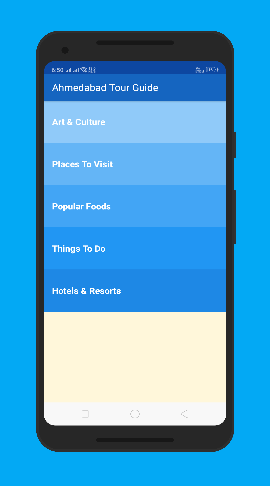
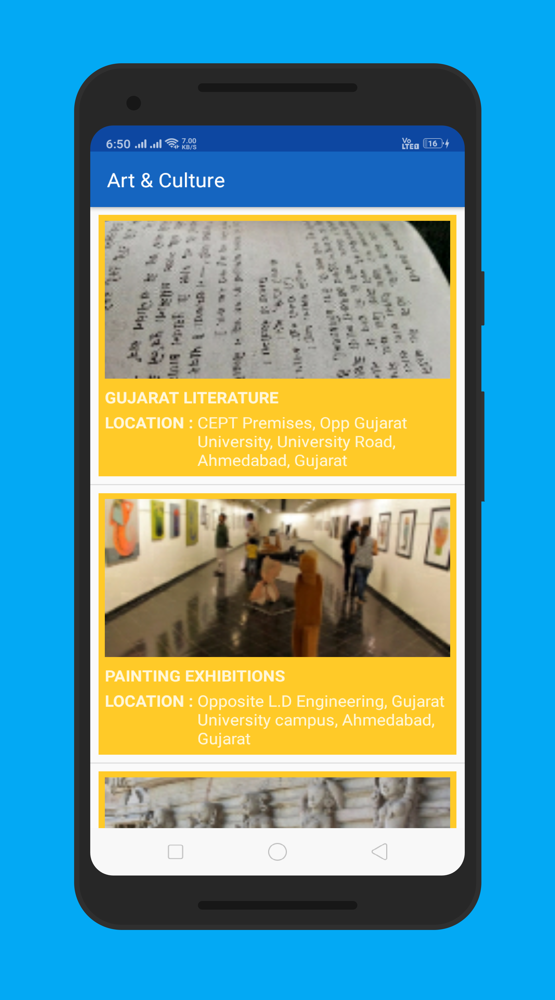
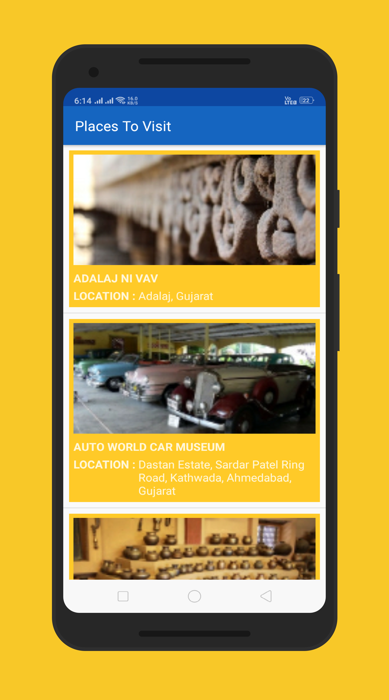
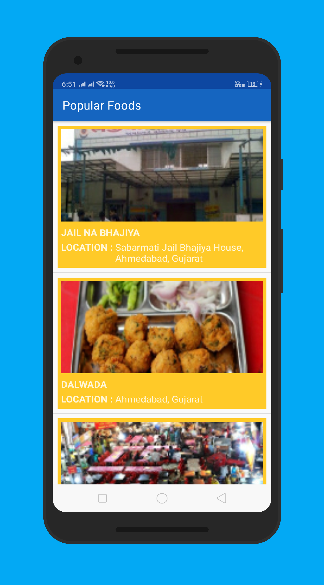
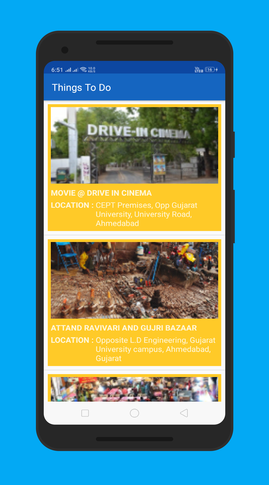
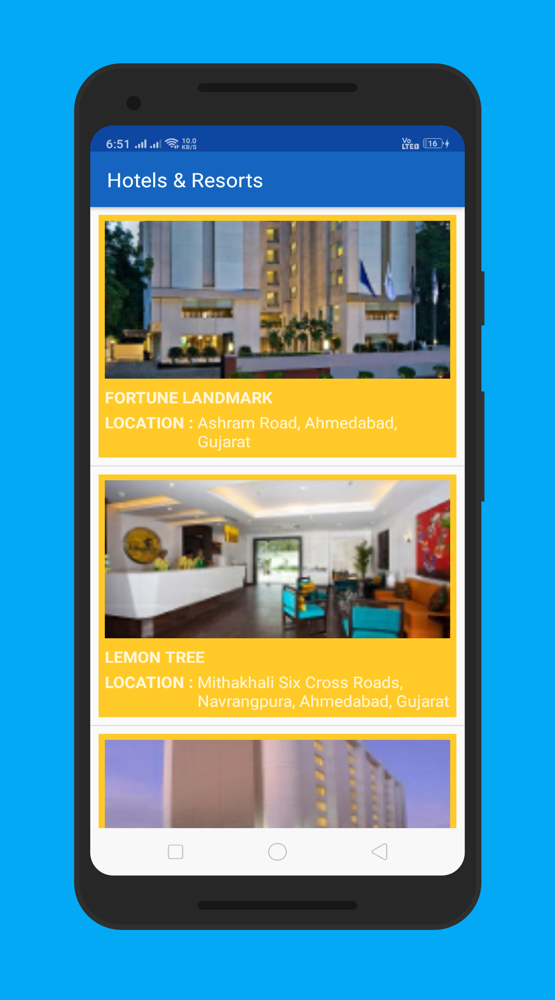

# TourGuide
This is the sixth project I've submitted to Udacity for the Android Basics NanoDegree. The main criteria of the Project is to create a tour guide app which presents relevant information to a user who’s visiting your city. The app can list top attractions, restaurants, public places, or events for the city. It can contain all the best known secrets that only locals know. It’s up to you which categories you want to provide, as well as what information to provide in each category.

## Screenshots

&ensp;

&ensp;

&ensp;
